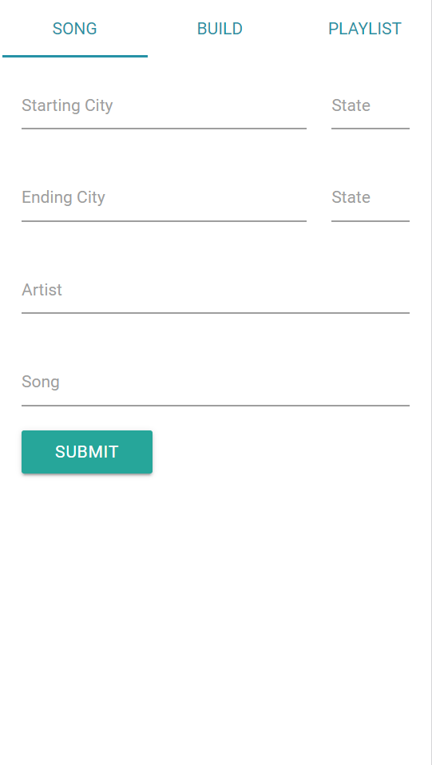
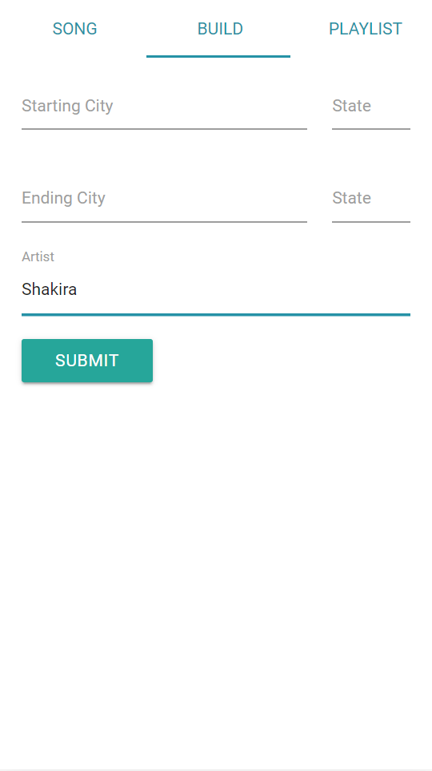
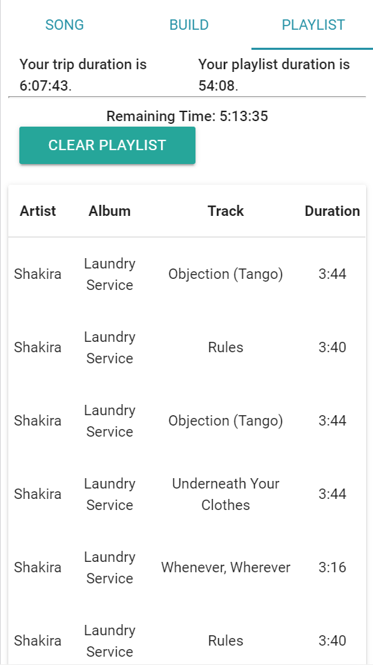

# TrackTrek

## Collaborators: Sean D'Amico, Eli Gorniak, Shane Nelson, Jackson Oppenheim, Brian Samuels

---

### Deployed App

https://speedhuntersam.github.io/TeamCharmander/

---

### Description

A web application that calculates the drive time of a treck, and compares it to the duration a playlist takes to play.

This allows you to plan out your Treck's Tracks!

---

### Technologies

-  Materialize
-  Axios
-  LocalForage
-  AudioScrobbler API
-  Mapquest API

---

### Images

#### Song Tab

---

#### Build Tab

---

#### Playlist Tab

